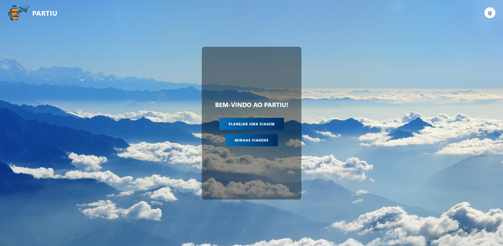
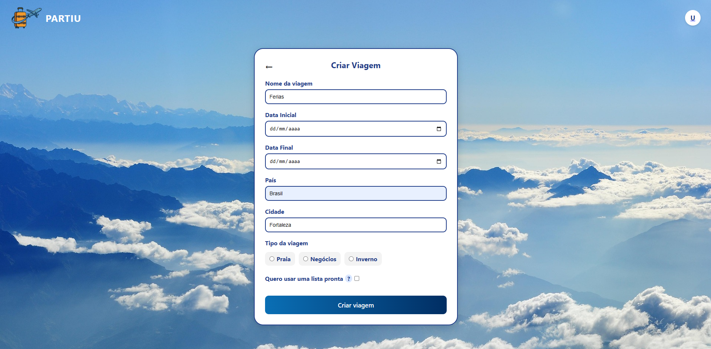
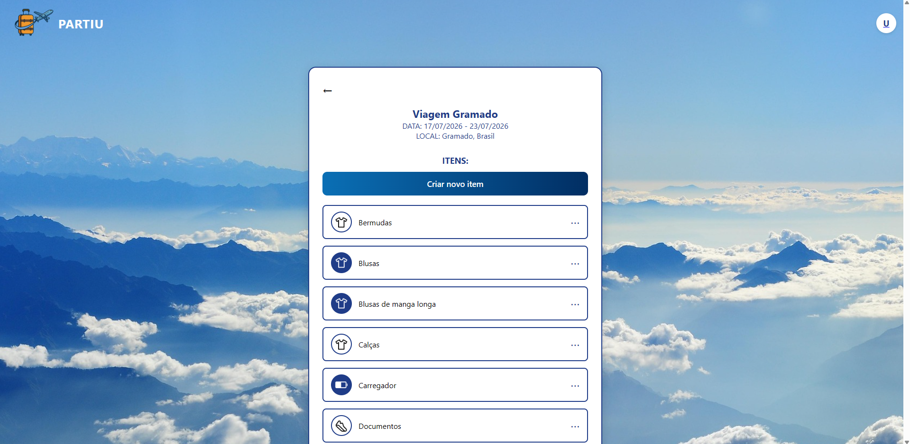

# Partiu - Seu Guia de Roteiros Personalizados

**Acesse o projeto:** 🔗 https://pi-front-end-xfkk.vercel.app/

## ✈️ Sobre o projeto

O Partiu é uma aplicação full stack web, construída durante o Projeto Integrador em grupo do curso TDS do Senac-RS, localizado na Unisinos em São Leopoldo.

A aplicação foi criada com o objetivo de facilitar a organização de viagens, ajudando usuários a planejarem e gerenciarem suas bagagens de forma prática e inteligente.

A aplicação oferece funcionalidades como:

### Criador de Bagagens Inteligente
O usuário informa destino, data de início e data de fim da viagem.
A aplicação calcula a duração da viagem e consulta a API da Meteostat para obter dados históricos de temperatura do destino no mesmo período em anos anteriores.
Com base na temperatura média calculada, o sistema seleciona automaticamente uma lista de itens recomendados adequada ao clima (frio, ameno ou quente).

### Checklist Interativo
Permite acompanhar, marcar e organizar os itens já separados para a viagem.

### CRUD de Usuários
Cadastro, edição, visualização e remoção de usuários.

### Gerenciamento de Viagens
Criação e controle das viagens associadas ao usuário.

### Gerenciamento de Itens
Sistema de CRUD para itens de bagagem.

## 📄 Artigo
O desenvolvimento do projeto, sua metodologia e resultados foram documentados em um artigo acadêmico produzido pelo grupo.

Acesse o artigo:
🔗 https://docs.google.com/document/d/1EqBjoTVies__iWvWqSQsSEkfYUd70aMIhwNsGml3GQM/edit?tab=t.2n2nbyoaudel

## 📊 Apresentação

A apresentação final do projeto pode ser acessada aqui:  
🔗 [Link para apresentação](https://www.canva.com/design/DAHBgurgXH0/zHW66BzhYEMyDuhK01nJow/edit?utm_content=DAHBgurgXH0&utm_campaign=designshare&utm_medium=link2&utm_source=sharebutton)

## 📸 Screenshots

### Tela Inicial

### Tela de Criação de Viagem

### Tela de Demonstração das Viagens

### Tela de Checklist de Itens

## 🛠 Tecnologias utilizadas

### Back end
- TypeScript
- Node.js

### Front end
- HTML 
- CSS 
- JavaScript

### APIs
- OpenWeather
- Meteostat

### Deploy
- Back end: Render
- Front end web: Vercel
- Banco de dados: Supabase

## 💡 Diferenciais do Projeto

- Uso de dados climáticos históricos para recomendação de bagagem  
- Geração automática de lista conforme clima do destino  
- Projeto full stack completo  
- Integração com APIs externas

## 👥 Equipe

Projeto desenvolvido em grupo por:

- Pedro Nunes – Full stack, Banco de Dados, Artigo – 🔗 [GitHub](https://github.com/PedroNunesc)  
- Leandro Guariniri – Back-End – 🔗 [GitHub](https://github.com/Thesantosz)  
- Stevão Rodrigues – Front-End, Apresentação – 🔗 [GitHub](https://github.com/Stevaoo)  
- Matheus Mattos – Front-End, Artigo – 🔗 [GitHub](https://github.com/matheusbmtt)  
- Lucas Machado Florão – Front-End – 🔗 [GitHub](https://github.com/lucasdocurso)  

## 👨‍💻 Minha contribuição

- **Desenvolvimento da lógica do Criador de Bagagens Inteligente:** cálculo de temperatura média usando as APIs e seleção automática de itens.
- **Integração com APIs de clima:** OpenWeather e Meteostat.
- **Implementação dos CRUDs:** usuários, viagens e itens.
- **Participação na versão final do sistema:** ajustes de UX/UI e funcionalidades.
- **Criação do Banco de Dados:** modelagem no Supabase.
- **Participação no Artigo:** documentação acadêmica do projeto.

## 👤 Autor

Pedro Nunes
- 🔗 LinkedIn: http://www.linkedin.com/in/pedro-nunes-hc
- 🔗 Github: https://github.com/PedroNunesc